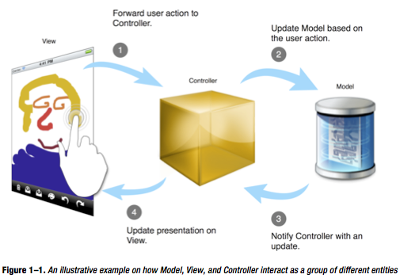

#Chap1. Hello, Design Patterns!

Algunas reglas básicas:

* Mejor la composición que la herencia de clases.
* Programar para una interfaz frente a hacerlo para una implementación.

Con esto se eliminan las dependencias y disminuye el acoplamiento.

El origen de los patrones se puede decir que es **MVC**, que nació en los primeros días de SmallTalk.

La versión de MVC que implementa Cocoa Touch incluye los siguientes patrones:

* **Compuesto:** unas vistas van dentro de otras.
* **Comando:** un objeto de la vista puede ejecutar una acción en otro objeto. Es decir, target-action.
* **Mediador:** flujo bidireccional entre objetos del modelo y la vista. Cuando cambia un modelo se notifica a la vista a través de los controladores (KVO).
* **Estrategia:** las vistas delegan toda la lógica al controlador, que son los que definen dicha estrategia.
* **Observador:** un objeto se apunta como "interesado" para ser notificado de ciertos cambios.

> This is what’s happening in Figure 1–1:

> 1. The user creates a touch event by touching or dragging her finger across the canvas view. The actual view (layer) being touched is right at a particular level in a view composite. The canvas (view) forwards the touch information to its view controller.
2. The controller object receives the touch event and its related information. It then applies a strategy to change the state of a model and/or request the view object to update its behavior or appearance based on the same event.
3. Once a change has occurred and has been updated in the model object, the model object notifies all registered observer objects such as controllers.
4. The controller acts as a mediator to communicate any changed data from the model to the view(s), so they can update their appearances accordingly.

###Herencia de clases vs. interfaces
Una interfaz define un tipo y una herencia de interfaz un subtipo.

Con la herencia de clases se hereda toda la funcionalidad.

El polimorfismo depende de los interfaces.

En Java existen los interfaces que sirven como *contrato* entre el cliente y los objetos concretos. En Obj-C existen los **protocolos**.

####Ventaja de usar protocolos a subtipos
* No hay que vigilar el tipo exacto del objeto, solo si cumple el protocolo.
* Los clientes solo conocen los métodos definidos en el protocolo, pero desconocen la clase en sí.
* Esto define el dogma principal del diseño orientado a objetos reutilizables:  
> Programar para una interfaz, no para una implementación

Los protocolos existen principalmente porque en Obj-C no hay herencia múltiple y si por ejemplo una vista (subclase de UIView) tiene que ser una clase abstracta de algo nuesto, entonces debemos definir un protocolo para tener ese contrato vinculante.

**ABO** = Abstract Base Class

Una solución flexible es tener una ABO para clases que no necesiten subclasear a otras clases, y después definir un protocolo del mismo nombre para las clases que necesiten incluir la ABO.  
Esta estrategia se utiliza por ejemplo con los *NSObject* de Cocoa Touch Framework, donde NSObject también cumple el protocolo NSObject.
